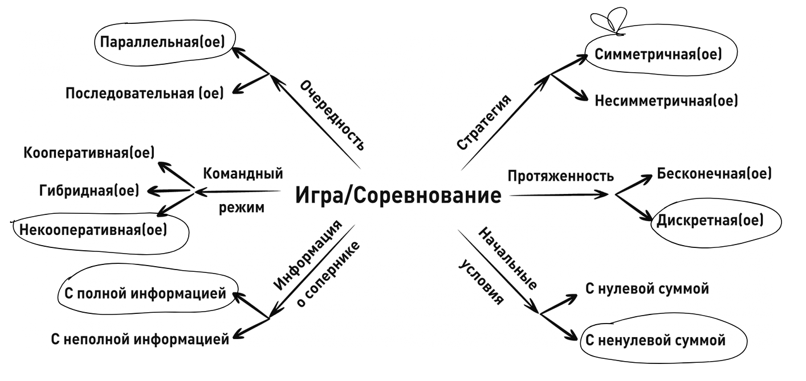

# Итоговый проект по курсу Основы теории игр
---
# Распределение весов в спортзале
---
## Подготовили:
- #### 
- #### 
- #### 

---


### Условия игры

В тренировочный зал ходят 2 спортсмена. Каждый из них может тренировать только одну группу мышц в определенный день. Оба спортсмена не могут выполнять одинаковые тренировки одновременно из-за нехватки оборудования, за счет чего им необходимо подобрать оптимальную стратегию выбора тренировок.

1. Три слота в день:
Тренировочный день состоит из 3 слотов, каждый из которых привязан к тренировке определенной группы мышц:
   	- S1 = Ноги (1);
   	- S2 = Спина (2);
   	- S3 = Грудь (3).

2. Выбор спортсменов:
   - Каждый игрок может выбрать максимум 2 слота в день;
   - Выбранные слоты приносят ценность спортсмен, если нет конфликта (оба не выбрали один и тот же слот).

3. Конфликты:
   - Если оба спортсмен выбирают один и тот же слот, он становится недоступным для обоих (ценность = 0).

---

#### Типы игр



#### Равновесие по Нэшу


Игрок 1: S1, S2, Игрок 2: S1, S3 → (2, 3)
Игрок 1: S1, S3, Игрок 2: S1, S2 → (3, 2)

#### Равновесие по Парето


(0, 0): Доминируется любым другим исходом
(2, 3): Не доминируется другими исходами
(1, 3): Доминируется исходом (2, 3)
(3, 2): Не доминируется другими исходами
(1, 2): Доминируется исходом (3, 2)
(3, 1): Доминируется исходом (3, 2)
(2, 1): Доминируется исходом (3, 1)

#### Смешанные стратегии

Пусть теперь добавятся условия:

- теперь есть два дня для записи;
- в 1 и 2 день задана вероятность выбора группы мышц (например, предпочтения);
- нельзя тренировать 1 группу мышц 2 дня подряд;
- задача - набрать максимальную сумму.

```python
import random

def simulate_dynamic_game(player1_probs, player2_probs, slot_values, invalid_pairs, num_simulations=10000):
    """
    Симуляция динамического анализа для двухдневной игры с учетом взаимосвязей между днями.

    :param player1_probs: Вероятности выбора слотов Игроком 1 для двух дней (dict).
    :param player2_probs: Вероятности выбора слотов Игроком 2 для двух дней (dict).
    :param slot_values: Словарь с ценностями слотов (dict).
    :param invalid_pairs: Список пар недопустимых слотов между днями (list).
    :param num_simulations: Количество симуляций (int).
    :return: Средние выигрыши для каждого игрока.
    """
    player1_total = 0
    player2_total = 0

    for _ in range(num_simulations):
        # День 1: Выборы игроков
        day1_p1 = random.choices(list(player1_probs["day1"].keys()), weights=player1_probs["day1"].values(), k=2)
        day1_p2 = random.choices(list(player2_probs["day1"].keys()), weights=player2_probs["day1"].values(), k=2)

        # Обработка конфликтов в День 1
        conflict_slots = set(day1_p1) & set(day1_p2)
        day1_slots_p1 = set(day1_p1) - conflict_slots
        day1_slots_p2 = set(day1_p2) - conflict_slots

        # День 2: Определение доступных слотов
        valid_day2_p1 = [s for s in player1_probs["day2"] if all((d1, s) not in invalid_pairs for d1 in day1_slots_p1)]
        valid_day2_p2 = [s for s in player2_probs["day2"] if all((d1, s) not in invalid_pairs for d1 in day1_slots_p2)]

        # День 2: Выборы игроков
        day2_p1 = random.choices(valid_day2_p1, weights=[player1_probs["day2"].get(s, 0) for s in valid_day2_p1], k=2)
        day2_p2 = random.choices(valid_day2_p2, weights=[player2_probs["day2"].get(s, 0) for s in valid_day2_p2], k=2)

        # Обработка конфликтов в День 2
        conflict_slots_day2 = set(day2_p1) & set(day2_p2)
        day2_slots_p1 = set(day2_p1) - conflict_slots_day2
        day2_slots_p2 = set(day2_p2) - conflict_slots_day2

        # Подсчёт выигрышей
        player1_total += sum(slot_values[slot] for slot in day1_slots_p1) + sum(slot_values[slot] for slot in day2_slots_p1)
        player2_total += sum(slot_values[slot] for slot in day1_slots_p2) + sum(slot_values[slot] for slot in day2_slots_p2)

    # Ожидаемые выигрыши
    player1_avg = player1_total / num_simulations
    player2_avg = player2_total / num_simulations

    return player1_avg, player2_avg

# Пример вероятностей и ценностей слотов
player1_probs = {
    "day1": {"S1": 0.3, "S2": 0.2, "S3": 0.5},
    "day2": {"S4": 0.6, "S5": 0.2, "S6": 0.2}
}

player2_probs = {
    "day1": {"S1": 0.3, "S2": 0.3, "S3": 0.4},
    "day2": {"S4": 0.4, "S5": 0.3, "S6": 0.3}
}

slot_values = {"S1": 1, "S2": 2, "S3": 3, "S4": 1, "S5": 2, "S6": 3}
invalid_pairs = [("S1", "S4"), ("S2", "S5"), ("S3", "S6")]

day1_avg, day2_avg = simulate_dynamic_game(player1_probs, player2_probs, slot_values, invalid_pairs)

print(f"Средний выигрыш Игрока 1: {day1_avg}")
print(f"Средний выигрыш Игрока 2: {day2_avg}")
```

Входные данные:


Выходные данные:


Кооперативных подход предполагает проверку всех возможных комбинаций при учете всех условий:

```python
import itertools

def maximize_cooperative_strategy(slot_values, invalid_pairs):
    """
    Вычисляет кооперативную стратегию для максимизации общей суммы выигрышей за два дня.

    :param slot_values: Словарь с ценностями слотов (dict).
    :param invalid_pairs: Список пар недопустимых слотов между днями (list).
    :return: Оптимальная стратегия и максимальная сумма выигрышей.
    """
    strategies_day1 = list(itertools.combinations(["S1", "S2", "S3"], 2))
    strategies_day2 = list(itertools.combinations(["S4", "S5", "S6"], 2))

    best_total_value = 0
    best_combination = None

    for strategy1_p1, strategy1_p2 in itertools.product(strategies_day1, repeat=2):
        conflict_slots_day1 = set(strategy1_p1) & set(strategy1_p2)
        strategy1_p1_actual = set(strategy1_p1) - conflict_slots_day1
        strategy1_p2_actual = set(strategy1_p2) - conflict_slots_day1

        for strategy2_p1, strategy2_p2 in itertools.product(strategies_day2, repeat=2):
            if any((s1, s2) in invalid_pairs for s1 in strategy1_p1_actual for s2 in strategy2_p1):
                continue
            if any((s1, s2) in invalid_pairs for s1 in strategy1_p2_actual for s2 in strategy2_p2):
                continue

            conflict_slots_day2 = set(strategy2_p1) & set(strategy2_p2)
            strategy2_p1_actual = set(strategy2_p1) - conflict_slots_day2
            strategy2_p2_actual = set(strategy2_p2) - conflict_slots_day2

            total_value = (
                sum(slot_values[s] for s in strategy1_p1_actual) +
                sum(slot_values[s] for s in strategy1_p2_actual) +
                sum(slot_values[s] for s in strategy2_p1_actual) +
                sum(slot_values[s] for s in strategy2_p2_actual)
            )

            if total_value > best_total_value:
                best_total_value = total_value
                best_combination = {
                    "day1": {"player1": strategy1_p1, "player2": strategy1_p2},
                    "day2": {"player1": strategy2_p1, "player2": strategy2_p2},
                }

    return best_combination, best_total_value

slot_values = {"S1": 1, "S2": 2, "S3": 3, "S4": 1, "S5": 2, "S6": 3}
invalid_pairs = [("S1", "S4"), ("S2", "S5"), ("S3", "S6")]

optimal_strategy, max_value = maximize_cooperative_strategy(slot_values, invalid_pairs)

print(f"Оптимальная стратегия: {optimal_strategy}")
print(f"Максимальная сумма выигрышей: {max_value}")
```


Данный результат довольно очевиден, надо просто 2 дня закинуть “Ноги” в конфликтный слот, а оставшиеся два поменять местами, чтобы получить (2,3) и (3,2) соответственно


